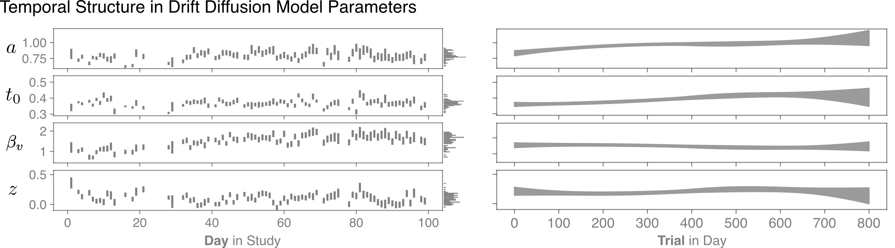

### drift-diffusion
> Quantifying Uncertainty in Drift Diffusion Models of Decision Making under Temporal Dependence and Misspecification



[](https://griegner.github.io/drift-diffusion/poster/poster-15NOV2025.pdf)
[](https://griegner.github.io/drift-diffusion/slides/slides-12NOV2025.pdf)
[](https://codecov.io/gh/griegner/drift-diffusion)

**Project Organization**
```
.
├── drift_diffusion/
│   ├── model/              <- drift diffusion model class
│   ├── sim/                <- simulation functions
│   └── tests/              <- unit tests
├── docs/
│   └── ...                 <- latex/pdf documentation files
├── figures/
│   ├── datasets/           <- Reinagel 2013 rats 195 and 196
│   ├── results/            <- precomputed simulation and analysis results
│   ├── fig01.ipynb         <- drift diffusion model example
│   ├── fig01.py            <- ...
│   ├── fig02to04.ipynb     <- validation by simulation
│   ├── fig02to04.py        <- ...
│   ├── fig05to06.ipynb     <- application to rat decision making
│   ├── fig05to06.py        <- ...
│   └── fig06.ipynb         <- ...

├── LICENSE                 <- MIT license
├── pyproject.toml          <- python configuration and dependencies
└── README.md               <- this readme file
```
