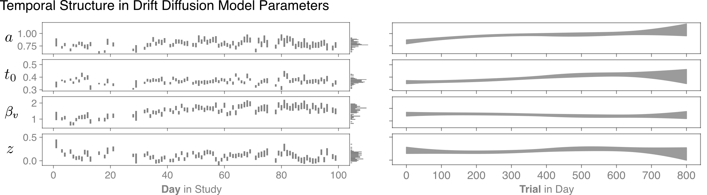

### drift-diffusion
> Quantifying uncertainty in drift diffusion models of decision making under temporal dependence and parameter variability



[](https://griegner.github.io/drift-diffusion/poster/poster-15NOV2025.pdf)
[](https://griegner.github.io/drift-diffusion/slides/slides-12NOV2025.pdf)
[](https://codecov.io/gh/griegner/drift-diffusion)

**Overview**

This repository provides a computationally efficient method for estimating drift diffusion model parameters with analytical uncertainty estimates that remain valid under temporal dependence and parameter variability. It also supports covariates to model nonstationary changes in decision making over time.

*Method Implementation*: The `drift-diffusion` package can be installed and used in your own research by following the installation instructions and usage examples below.

*Paper Reproduction*: The accompanying Code Ocean capsule enables readers to run, verify, and modify the code and data in the cloud. The results reported in the bioRxiv paper can be reproduced at [CO.5868634.v1](https://doi.org/10.24433/CO.5868634.v1).

*Citation*:
```bibtex
@article{riegner2026,
  title={Quantifying uncertainty in drift diffusion models of decision making under temporal dependence and parameter variability},
  author={Riegner, Gabriel and Schwartzman, Armin and Reinagel, Pamela},
  journal={bioRxiv},
  year={2026},
  publisher={Cold Spring Harbor Laboratory}
}
```

**Package Installation**

Install `drift-diffusion` and dependencies:
```
pip install git+https://github.com/griegner/drift-diffusion.git
```

**Usage Examples**

`DriftDiffusionModel` fits decision making parameters by maximum likelihood estimation.
The four decision making parameters (`a, t_0, v, z`) can each be linear functions of coefficients and
sample-by-sample covariate columns in `X`; and each can be *fixed*, *free*, or *mixed*.
*Free* parameters/coefficients are estimated during `fit` and defined with Wilkinson notation to specify linear
relationships with covariates (e.g. `v = "+1 + coherence"`; see [formulaic](https://matthewwardrop.github.io/formulaic)).
*Fixed* parameters are set at initialization by passing a float. *Mixed* coefficients can be defined with a dict,
for example `v={"formula": "+1 + coherence", "fixed": {"coherence": 1.0}}`, where *fixed* coefficients are
excluded from optimization but included in likelihood evaluation.

```python
>>> import numpy as np, pandas as pd
>>> from drift_diffusion.model import DriftDiffusionModel
>>> from drift_diffusion.sim import sample_from_pdf
>>> n = 1000; stim = np.linspace(-1, +1, n); X = pd.DataFrame({"stim": stim})
```

(i) *Fixed*: fix `t0, v, z`; fit `a`
```python
>>> y = sample_from_pdf(a=1.0, t0=0.2, v=0.3, z=0, n_samples=n, random_state=0)
>>> ddm = DriftDiffusionModel(a="+1", t0=0.2, v=0.3, z=0).fit(X, y)  # intercept/constant `a`
>>> ddm.params_, ddm.covariance_ # parameter/standard error estimates for `a`
(array([0.99537521]), array([[0.0001443]]))
```

(ii) *Free*: set `v = beta * stim`; fit `a, beta, t0, z`
```python
>>> beta_v = 0.8; v = beta_v * stim # v as linear function of stimulus
>>> y = sample_from_pdf(a=1.0, t0=0.2, v=v, z=0, n_samples=n, random_state=1)
>>> ddm = DriftDiffusionModel(a="+1", t0="+1", v="-1 + stim", z="+1").fit(X, y)
>>> ddm.params_, np.sqrt(np.diag(ddm.covariance_))  # parameter/standard error estimates for `a, t0, beta_v, z`
(array([ 0.98992872,  0.19523826,  0.81235863, -0.00421529]),
 array([0.01535874, 0.00801454, 0.05959234, 0.0175263 ]))
```

(iii) *Mixed*: set `v = beta0 + beta1*stim + beta2*stim**2`; fix `beta1, beta2`; fit `beta0`
```python
>>> intercept = -0.5; v = intercept + stim + stim**2  # v as quadratic function of stimulus
>>> y = sample_from_pdf(a=1.0, t0=0.2, v=v, z=0, n_samples=n, random_state=2)
>>> ddm = DriftDiffusionModel(a=1.0, t0=0.2, v={"formula": "+1 + stim + {stim ** 2}", "fixed": {"stim": 1, "stim ** 2": 1}}, z=0).fit(X, y)
>>> ddm.params_, np.sqrt(ddm.covariance_)  # parameter/standard error estimates for intercept
(array([-0.54279923]), array([[0.03392439]]))
```

(iv) *Covariance Estimators*: `"sample-hessian"`-`"autocorrelation-robust"` are valid under increasingly general conditions on the sequence of choice and reaction times `y`
```python
>>> ddm.set_params(cov_estimator="all").fit(X, y).covariance_
{
    'sample-hessian': array([[0.00115086]]),
    'outer-product': array([[0.00110442]]),
    'misspecification-robust': array([[0.00119926]]),
    'autocorrelation-robust': array([[0.00119337]])
}
```

**Repository Organization**

*Method Implementation*:
```
.
├── drift_diffusion/
│   ├── model/
│   │   ├── drift_diffusion_model.py    <- drift diffusion model (ddm)
│   │   └── pdf.py                      <- probability density function (pdf)
│   ├── sim/
│   │   └── sim.py                      <- simulation functions
│   └── tests/
│       ├── test_model.py               <- unit tests for ddm and pdf
│       └── test_sim.py                 <- unit tests for simulation functions
├── docs/
│   └── ...                             <- latex/pdf documentation files
├── LICENSE                             <- MIT license
├── pyproject.toml                      <- python configuration and dependencies
└── README.md                           <- this readme file
```

*Paper Reproduction*:
```
.
├── code/
│   ├── fig*.py                         <- python scripts for figures 1-7
│   └── run.sh                          <- bash script that runs all python scripts
├── data/
│   └── Rat195Vectors_290426.csv        <- dataset used in paper
├── environment/                        <- compute environment
├── metadata/                           <- title/abstract
└── results/                            <- outputs of reproducible run
```
